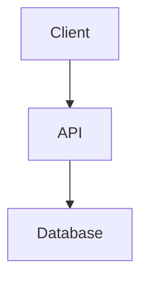

# System Architecture

## Overview
Decoupled monolith architecture.

cess, and track overall institutional performance.

### Expected Impact
- Increased placement success rates through structured, trackable preparation.
- Enhanced technical and communication skills via continuous AI feedback.
- Data-driven self-awareness for students regarding their readiness for specific target companies.

---

## 2. Complete Feature List

### Dashboard & Streaks
- **Daily Goals Tracker**: Allows users to set, track, and check off micro-goals for the day.
- **Streak System**: Gamifies learning by tracking consecutive days of activity, recording current and longest streaks to boost retention.
- **Activity Feed**: A live chronological log of user events (e.g., submitting code, completing a mock test).

### Structured Learning Paths (Prep Ecosystem)
- **Track & Topic Hierarchy**: Curriculum is organized into macro-Tracks (e.g., Data Structures) and micro-Topics (e.g., Arrays, HashMaps).
- **Interactive Visualizations**: Custom visual components built to explain complex algorithms (e.g., Sliding Window, Graph DFS) visually.
- **Progress Tracking**: Granular, percentage-based completion tracking at the topic and track levels.

### Practice Workspace & Mock Tests
- **Topic-wise Question Bank**: Curated multiple-choice questions categorized by difficulty (Easy, Medium, Hard).
- **Timed Mock Simulator**: Aggregates questions from various topics into a high-stakes, timed test environment.
- **Automated Scoring**: Instant evaluation of submitted tests with detailed accuracy breakdowns.

### Interactive Coding Workspace (Code Lab)
- **Problem Arena**: A categorized list of coding problems (algorithmic challenges) with acceptance rates and difficulty levels.
- **In-Browser Code Editor**: A dedicated workspace supporting multiple languages (Python, JavaScript, C++, Java).
- **Code Execution Engine**: Captures user code, runs it against hidden test cases, and returns execution metrics (`stdout`, `stderr`, execution time, memory usage).
- **Submission History**: R