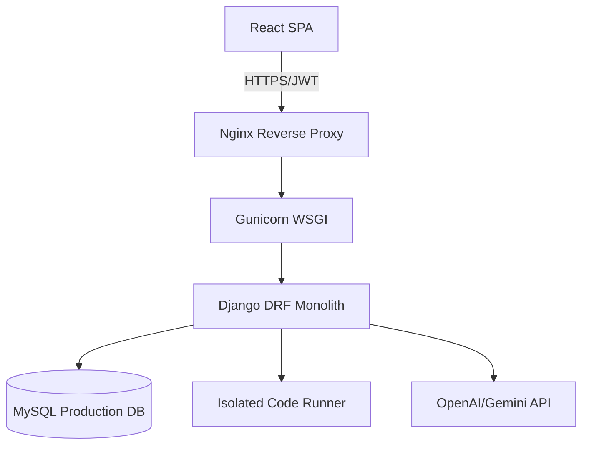

# PrepSmart Diagrams

All architectural diagrams are generated in Mermaid syntax below.

## 1. Architecture Diagram

```mermaid
graph TD
    Client[React SPA] -->|HTTPS/JWT| Nginx[Nginx Reverse Proxy]
    Nginx --> Gunicorn[Gunicorn WSGI]
    Gunicorn --> Django[Django DRF Monolith]
    Django --> MySQL[(MySQL Production DB)]
    Django --> Subprocess[Isolated Code Runner]
    Django --> LLM[OpenAI/Gemini API]
```
